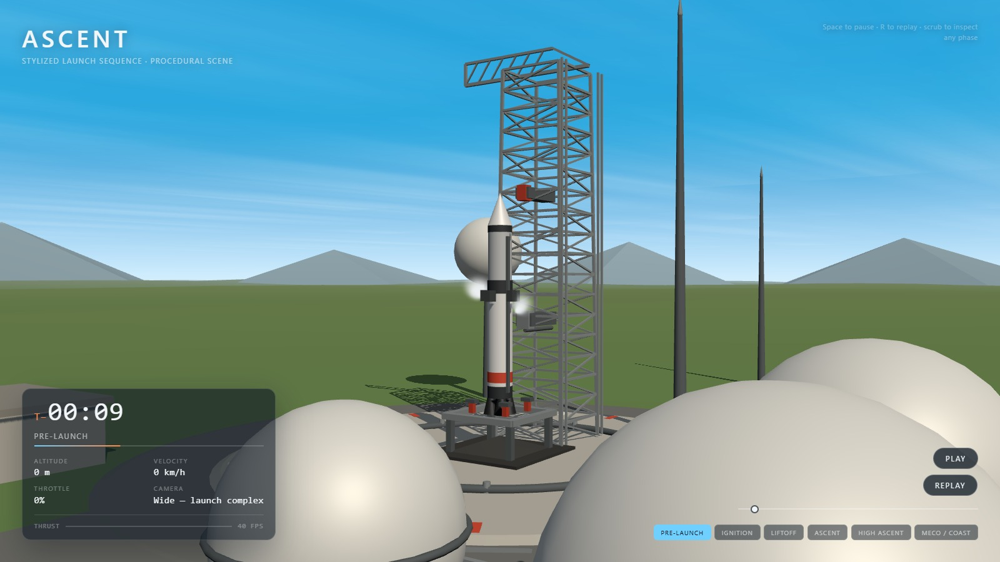
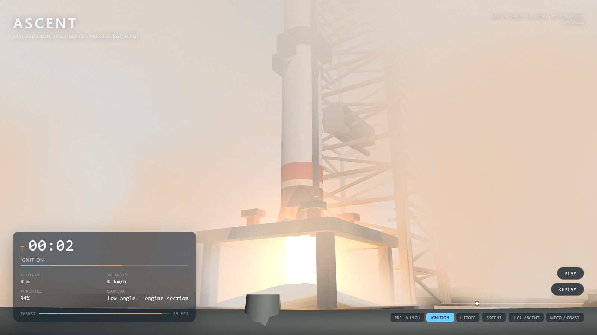
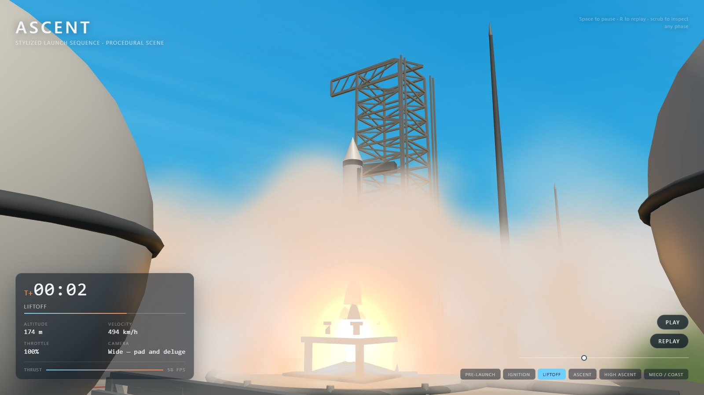
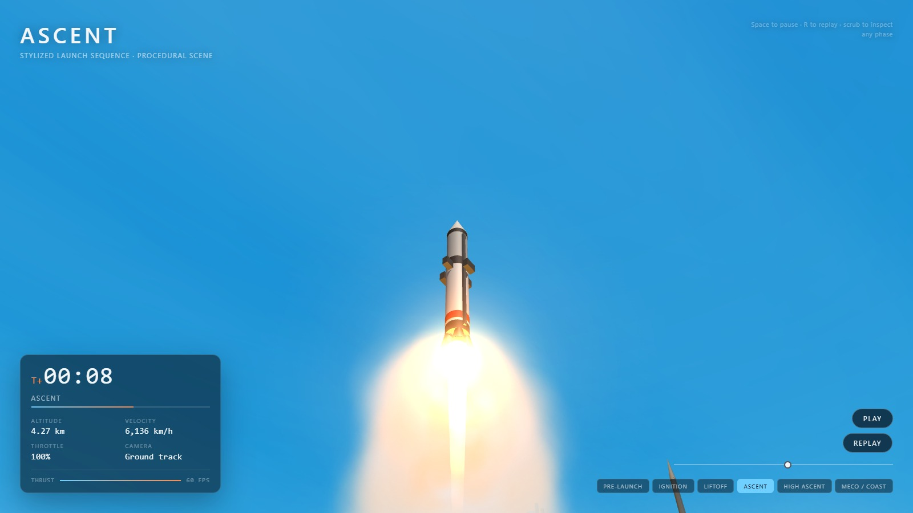
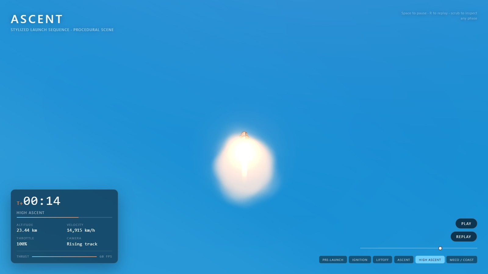

# Ascent — a stylized 3D rocket launch

An interactive, real-time recreation of a rocket launch: a stylized launch
complex, a complete ignition-to-ascent sequence, and a camera director that
carries the shot from pad level up into the upper atmosphere.

The scene loops from T−12s to T+22.5s, with T−0 as liftoff. You can play, pause,
scrub, or jump straight to any phase from the HUD.

Everything is procedural. There are no model, texture, or HDRI assets — geometry
is built from primitives and effects, and every sprite texture is drawn to a
canvas at runtime.



## Technologies

| | |
| --- | --- |
| **Framework** | React 19 + TypeScript 5.9, built with Vite 8 |
| **3D** | three.js 0.186 via React Three Fiber 9 — no scene-graph helper libraries |
| **Effects** | Custom GLSL shaders (sky dome, exhaust plume) and a pooled instanced-billboard particle system |
| **Assets** | None — all geometry and textures are generated procedurally at runtime |

## Getting started

```bash
npm install
npm run dev        # http://127.0.0.1:5178
```

Other scripts:

```bash
npm run build      # typecheck + production bundle into dist/
npm run preview    # serve the production build on :4178
npm run typecheck  # tsc -b
```

Requires a browser with WebGL2. If WebGL is unavailable the app shows a short
fallback message instead of a blank canvas.

## The launch sequence

| Phase | Window | What happens |
| --- | --- | --- |
| Pre-launch | T−12 … T−6.5 | Vehicle static on the mount, cryogenic vapour venting |
| Ignition | T−6.5 … T−0 | Turbopumps spool, igniter charge burns, deluge floods the pad |
| Liftoff | T−0 … T+4 | Hold-downs release, umbilicals retract, slow initial climb |
| Ascent | T+4 … T+11 | Sustained acceleration, ground smoke falls away |
| High ascent | T+11 … T+16.5 | Plume stretches in near-vacuum, camera rises alongside |
| MECO / coast | T+16.5 … | Throttle to zero, ballistic coast, open sky |

## How it works

The guiding decision is that **the whole experience is a pure function of one
number** — the mission clock. Nothing keeps its own animation state, so the
sequence is deterministic, scrubbable, and easy to verify.

```
src/
  mission/     the timeline, the camera shot list, and the shared clock
  scene/       launch complex, vehicle, sky, terrain, and effects
  fx/          procedural textures and the particle system
  ui/          the telemetry and playback overlay
```

- **`mission/mission.ts`** — `sampleMission(clock)` returns the complete vehicle
  state for any instant: throttle, flame, altitude, velocity, shake, and smoke
  emission rates. The profile climbs gently while clearing the tower, then
  accelerates to main engine cutoff and coasts.
- **`mission/cameraDirector.ts`** — eight hand-authored shots. Crossfades use a
  *complementary* pair of smoothsteps at each boundary, so adjacent shots'
  weights always sum to exactly 1 and the hand-off from the ground-level view to
  the rising tracking shot is continuous.
- **`scene/Exhaust.tsx`** — the plume is a unit-length cylinder anchored at the
  nozzle; stretching it on Y lengthens the plume without touching the shader's
  falloff. Additive blending through a double-sided shell gives it a volumetric
  core, with billboard flare sprites and a warm point light for the ignition
  glow.
- **`fx/particles.ts`** — one pooled particle class drives three emitters (pad
  deluge, exhaust trail, cryogenic vent). Billboards are offset in *view space*,
  so there is no point-size ceiling and puffs can grow large near the camera.

Draw calls stay between roughly 80 and 190 with 37k–47k triangles. The truss
tower is a single instanced mesh, each particle system is one instanced draw,
and shadows use a tight frustum around the pad.

## Screenshots

| Pre-launch | Ignition |
| --- | --- |
|  |  |

| Liftoff | Ascent |
| --- | --- |
|  |  |



## Credits

The reference footage used for palette and pacing came from a two-panel
before/after comparison clip; its split-screen layout was treated as a video
overlay rather than product UI, and its colours were sampled frame by frame to
drive the scene palette.

---

Built using the **DeepSeek-V4.1-Flash** model through **DeepSeek Harness**.